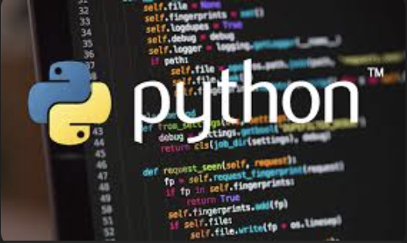

# 

<h1 align="center">Python Fundamentals</h1>
<h2 align="center">This is an introductory course in structured programming concepts using Python and assumes no prior programming experience</h2>

Why Learn Python at CCC?
Beginner-Friendly: The fundamentals courses are specifically designed for individuals with no prior coding knowledge.
Career Entry: Knowing Python is a great entry point into high-demand tech fields such as software development, data science, artificial intelligence, and automation.
Hands-on Experience: Courses emphasize practical application through hands-on lab activities, writing programs, and problem-solving. 
For the most up-to-date course schedules and registration information, please check the official City Colleges of Chicago website or catalog.
